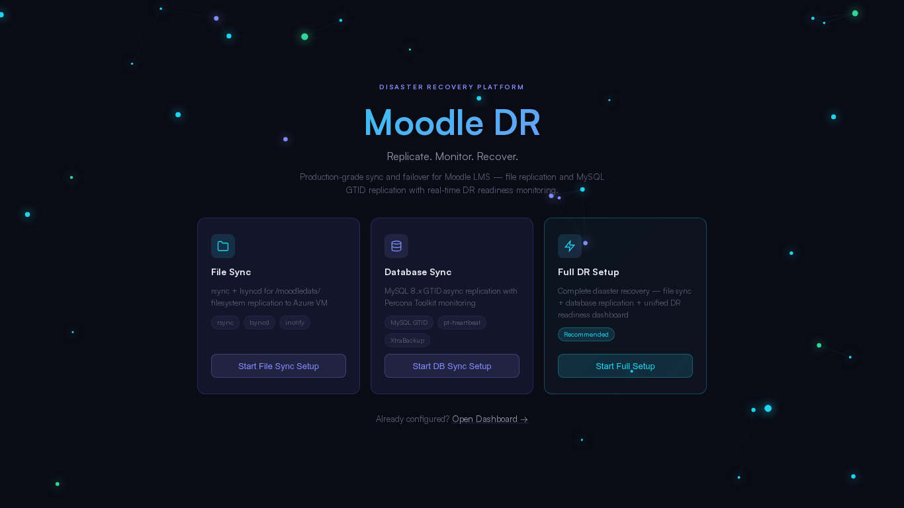
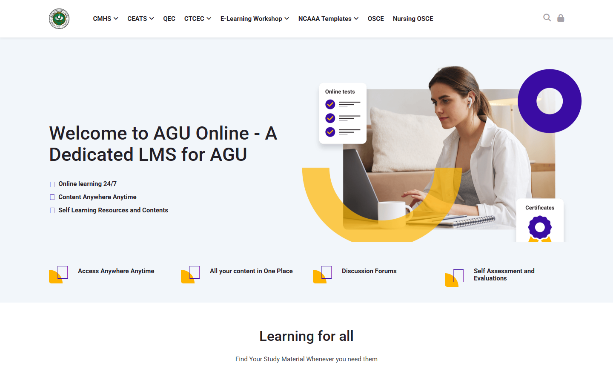
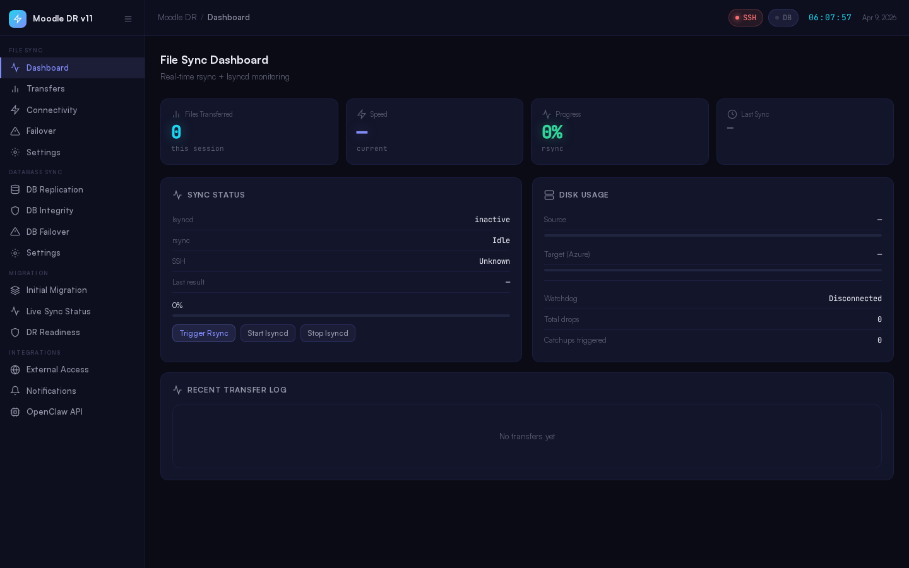
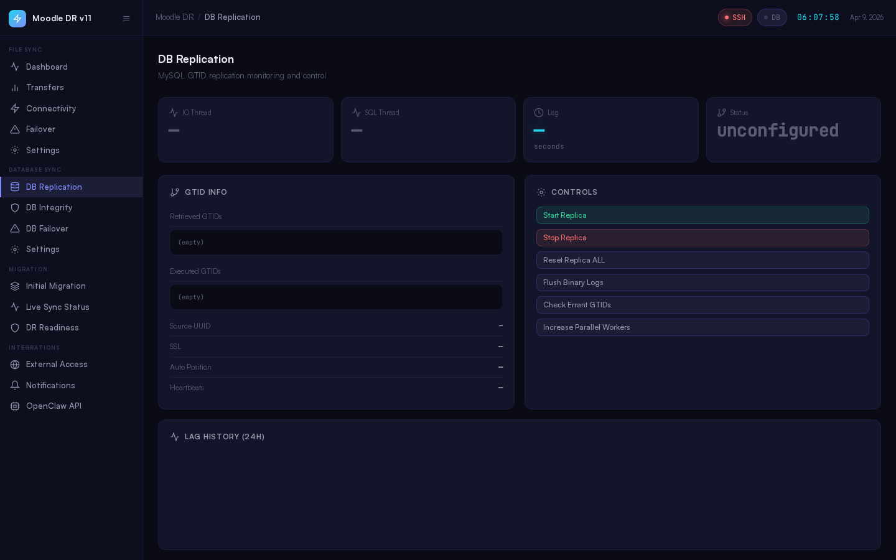
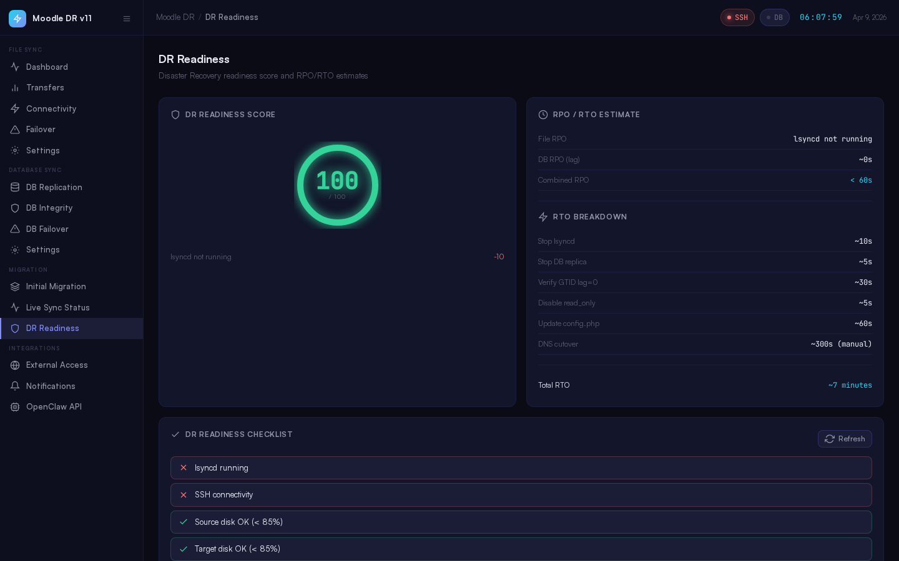
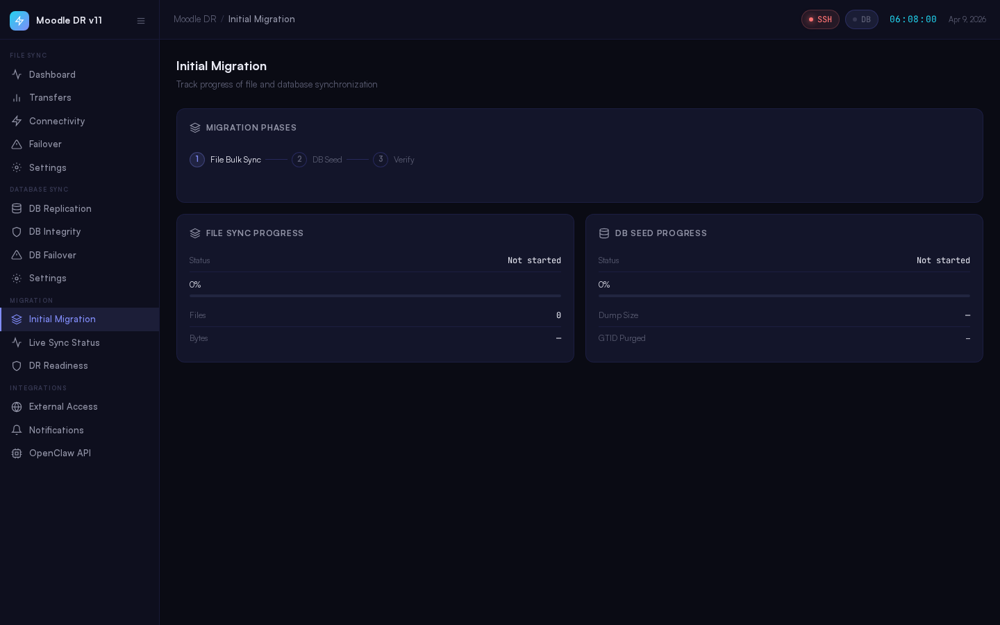
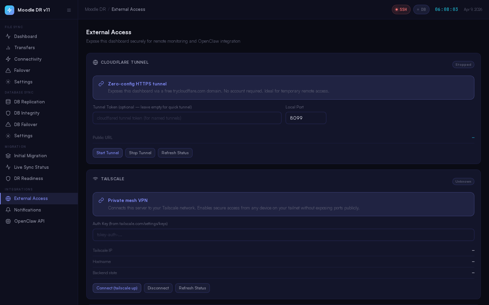
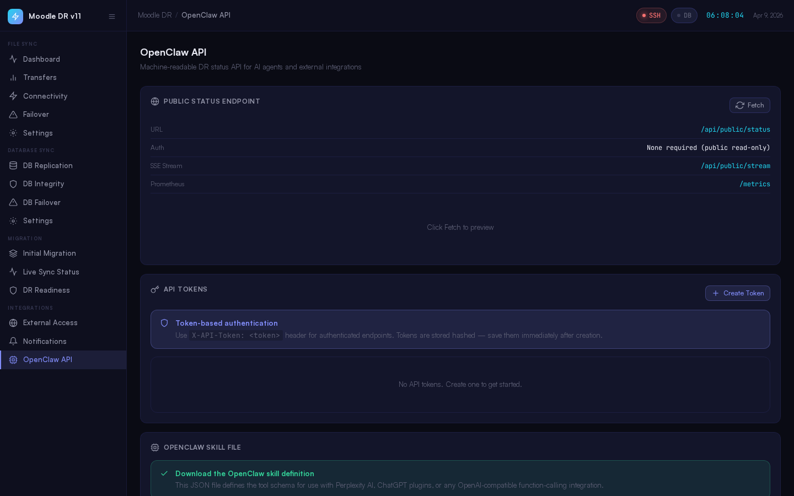
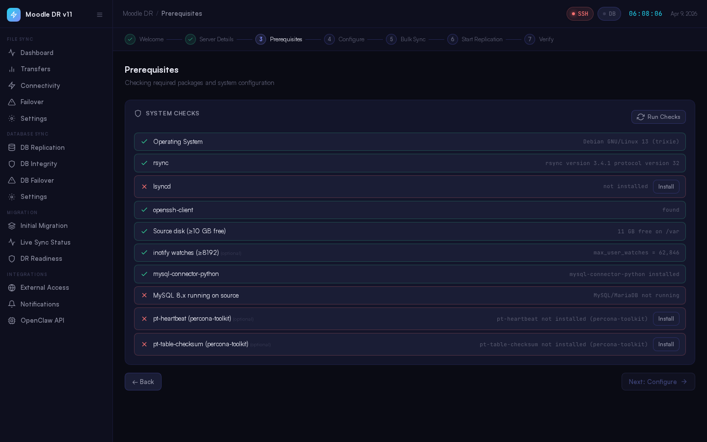

# Moodle DR

**Production-grade Disaster Recovery platform for Moodle LMS** — unified file replication, MariaDB/MySQL warm-standby replication over WireGuard VPN, real-time DR readiness monitoring, and one-click failover guidance.

> Built for on-prem Ubuntu → Azure VM warm standby. Manual failover only — operator decision always.

---



---

## What's New — v11

| Feature | Details |
|---------|---------|
| **WireGuard VPN tunnel** | Full automated setup, key generation, and status monitoring. DB replication runs over encrypted WireGuard tunnel (`10.10.0.1 ↔ 10.10.0.2`) |
| **WireGuard topbar pill** | Live green/red pill in the top bar polls `/api/integrations/wireguard/status` every 15s |
| **WireGuard page** | Dedicated page under Integrations — status cards, start/stop/restart controls, key generation, automated setup form, command reference |
| **DR score 100** | WireGuard tunnel active replaces pt-heartbeat in the scoring rubric — score reaches 100 when tunnel is up |
| **Lag humanization** | `lagFmt()` converts raw seconds to human-readable `Xd Xh Ym Xs` format across all lag displays |
| **MariaDB GTID support** | Uses `Gtid_IO_Pos` and `@@gtid_slave_pos` instead of MySQL-only fields — works with MariaDB 10.x |
| **DB topbar pill** | Direct `/api/db/health` poll in topbar — amber for lagging, green for healthy, grey for not configured |
| **Seed auto-detect** | On startup, if IO thread = Yes and SQL thread = Yes, seed is automatically marked complete |
| **Moodle container live** | Moodle 4.2.1 running as Docker container on Azure VM, connected to replicated MariaDB |
| **Nginx SSL** | Nginx reverse proxy with GlobalSign wildcard `*.agu.edu.bh` cert, HTTP→HTTPS redirect, `sslproxy=true` |

---

## Live DR Site

The Moodle DR instance is live at **[https://lmsdr.agu.edu.bh](https://lmsdr.agu.edu.bh)**



- Moodle 4.2.1+ (Build 20230728) with `mb2nl` theme
- 13,568 users replicated from production
- 541 tables in `agu_moodle311` database
- Replication lag: 0s (fully caught up)

---

## Features

### Setup Wizard (Track-Based)
Single setup wizard that forks by track. Choose what you need:

| Track | What it sets up |
|-------|----------------|
| **File Sync** | rsync + lsyncd for `/moodledata/` filesystem replication |
| **Database Sync** | MariaDB/MySQL GTID async replication with Percona Toolkit monitoring |
| **Full DR Setup** _(Recommended)_ | Both tracks unified — file sync + DB replication + DR readiness dashboard |

### WireGuard VPN Tunnel (New in v11)
- **Automated setup** — installs WireGuard, generates keypairs, writes `/etc/wireguard/wg0.conf`, enables and starts `wg-quick@wg0`
- **Live status page** — interface info, peer handshake time, transfer bytes, tunnel IP, config presence
- **Start / Stop / Restart / Enable / Disable** controls directly from the dashboard
- **Key generation** — generate new keypair from UI, displays public key for peer exchange
- **Topbar pill** — always-visible green/red WireGuard status indicator, polls every 15s
- **DR score integration** — WireGuard tunnel active = +8 pts in DR readiness score
- **Command reference** — built-in install, keygen, config, and troubleshooting cheatsheet

```
On-Prem (wg0: 10.10.0.1)  ←──── WireGuard UDP 51820 ────→  Azure VM (wg0: 10.10.0.2)
         MariaDB source                                        MariaDB replica
         CHANGE MASTER TO MASTER_HOST='10.10.0.1'
```

### File Sync
- **lsyncd** — inotify-driven real-time file sync over SSH
- **rsync** — initial bulk transfer + incremental sync
- Partial file detection and force-resume
- Transfer history with per-session stats (bytes, files, duration, success rate)
- SSH connectivity watchdog with auto-retry and event log
- File Sync Failover checklist with gated execution

### Database Sync
- **MariaDB 10.x + MySQL 8.x** GTID async replication — warm standby on Azure VM
- Replication over **WireGuard VPN tunnel** (encrypted, no public DB port exposure)
- **Percona Toolkit** integration: `pt-heartbeat`, `pt-table-checksum`, `pt-table-sync`
- DB seed via **mysqldump** (default) or **XtraBackup** (no-lock, faster for large DBs)
- Smart resume — if dump transferred but import failed, restart from import phase only
- `slave_exec_mode=IDEMPOTENT` auto-set to handle import/replication overlap
- SSL certificate generation and exchange
- Auto-configure: replication user, `my.cnf` on source and replica

### DB Monitoring
- Live IO/SQL thread status, GTID position, replication errors
- **lagFmt()** — human-readable lag: `2d 3h 15m 42s` instead of raw seconds
- **MariaDB GTID fields** — `Gtid_IO_Pos` and `@@gtid_slave_pos` (compatible with MariaDB 10.x)
- Sub-second heartbeat lag via pt-heartbeat (1s polling)
- **Amber pill** for lagging state, green for healthy, grey for not configured
- Table checksum verification (pt-table-checksum)
- Check history log with per-run results
- DB Failover — pre-flight checks, failover steps preview, gated execution

### DR Readiness Dashboard
- **Readiness Score 0–100** — animated ring gauge, real-time
- Score reaches **100** when: lsyncd running + DB IO/SQL Yes + WireGuard active + lag = 0
- **RPO estimate** — file RPO (lsyncd lag) + DB RPO (replication lag) → combined, formatted with `lagFmt()`
- **RTO breakdown** — step-by-step estimated recovery time (~7 minutes typical)
- DR Checklist — lsyncd, SSH, disk, MySQL threads, WireGuard tunnel active, lag thresholds
- DR Readiness is always the single source of truth before initiating failover

### Moodle Container (DR Site)
- Docker container (`moodle-frontend:v3`) running Moodle 4.2.1 on Azure VM
- `network_mode: host` — container shares VM network stack, DB accessible at `127.0.0.1`
- Custom `ports.conf` mount changes Apache to port 8888 (Nginx owns 80/443)
- `sslproxy = true` in `config.php` — handles X-Forwarded-Proto from Nginx correctly
- Bind-mounted `config.php` and `moodledata/` — no rebuild needed for config changes
- Image built from on-prem production server via `tar` + `docker load`

### Nginx SSL Reverse Proxy
- Nginx installed on Azure VM, owns ports 80 and 443
- HTTP → HTTPS redirect (301)
- Proxies to Moodle container at `127.0.0.1:8888`
- GlobalSign wildcard `*.agu.edu.bh` certificate (valid to Dec 2026)
- TLS 1.2 + 1.3, HSTS, X-Frame-Options, X-Content-Type-Options headers
- 2GB upload limit for course backups and assignments
- WebSocket support for Moodle 4.x messaging

### Migration Dashboards
- **Initial Migration** — phase tracker (File Bulk Sync → DB Seed → Verify), live progress bars
- **Live Sync Status** — real-time file sync + DB replication side-by-side, 24h lag chart

### Integrations & External Access
- **WireGuard VPN** — encrypted DB replication tunnel, automated setup from dashboard
- **Cloudflare Tunnel** — zero-config public HTTPS URL
- **Tailscale** — mesh VPN, join your tailnet with an auth key
- **SSH Tunnel** — generates ready-to-run `ssh -L` command for local port forwarding
- **Webhook Push** — outbound POST on 7 event types (DR score change, replication error, failover, etc.)
- **Notifications** — Telegram bot, Slack webhook, Discord webhook, Email (SMTP)

### OpenClaw / AI Agent API
- `/api/public/status` — machine-readable JSON status (no auth required for read-only)
- `/api/public/stream` — Server-Sent Events stream for real-time push
- `/metrics` — Prometheus-compatible metrics endpoint
- Token-based auth for detailed data (`X-API-Token` header)
- Downloadable OpenClaw skill file — teaches your local AI agent to query and alert on DR status

---

## Screenshots

### Welcome Screen — Track Selection


### File Sync Dashboard


### DB Replication Monitor


### DR Readiness — RPO/RTO Score


### Initial Migration Tracker


### External Access — WireGuard + Cloudflare + Tailscale


### OpenClaw API Integration


### Setup Wizard — Prerequisites Check


### Moodle DR — Live at lmsdr.agu.edu.bh


---

## Architecture

```
On-Prem Ubuntu 22.04                         Azure VM (Standard_D4s_v3)
┌──────────────────────────────────┐          ┌────────────────────────────────┐
│  Moodle App (Docker — prod)      │          │  Moodle App (Docker :8888)     │
│  MariaDB 10.6.22 (native host)   │──GTID──▶ │  MariaDB 10.11.14 (native)     │
│  /var/www/Azure-MoodleData/ 3TB  │──rsync──▶│  /moodledata/ (moodlesync)     │
│  lsyncd  (systemd service)       │          │  Nginx (SSL :443 → :8888)      │
│  WireGuard wg0: 10.10.0.1        │◀────────▶│  WireGuard wg0: 10.10.0.2     │
│  Moodle DR Dashboard :8080       │          │  https://lmsdr.agu.edu.bh      │
└──────────────────────────────────┘          └────────────────────────────────┘
                    ▲
                    │  UDP 51820 (WireGuard tunnel)
                    │  DB replication uses tunnel IP 10.10.0.1
```

**Key architecture decisions:**
- MariaDB/MySQL runs **native on host** (not in Docker) — required for GTID replication
- Docker is for **Moodle app containers only**
- DB replication travels over **WireGuard VPN** — no public DB port exposure
- Failover is **always manual** — dashboard guides, never auto-promotes
- Watchdog monitors only — never auto-recovers (operator decision always)
- Nginx owns ports 80/443; Apache inside container runs on 8888 via `ports.conf` bind-mount

---

## Tech Stack

| Layer | Technology |
|-------|-----------|
| Backend | FastAPI (Python 3.11), uvicorn |
| Frontend | Vanilla JS SPA — single `index.html`, no build step |
| DB (local) | SQLite via aiosqlite (transfers, replication history) |
| Replication | MariaDB 10.x / MySQL 8.x native GTID + Percona Toolkit |
| VPN Tunnel | WireGuard (`wg-quick@wg0`) — encrypted DB replication channel |
| File Sync | lsyncd + rsync over SSH |
| Containerization | Docker + docker-compose (app only, DB stays native) |
| Reverse Proxy | Nginx + GlobalSign wildcard SSL |
| Moodle | 4.2.1+ (Build 20230728), mb2nl theme |

---

## Quick Start

### Option A — Bare Metal (Recommended)

```bash
# 1. Clone the repo
git clone https://github.com/saichand04/moodle-dr.git
cd moodle-dr

# 2. Copy and configure environment
cp .env.example .env
nano .env    # Set TARGET_IP, SSH_KEY_PATH, credentials

# 3. Run the installer
chmod +x install.sh
sudo ./install.sh

# 4. Open the dashboard
# http://<your-server-ip>:8080
```

The installer:
- Creates a Python virtualenv at `/opt/moodle-dr/venv`
- Installs all dependencies
- Creates `/var/lib/moodle-dr/` data directory
- Registers and starts a systemd service (`moodle-dr.service`)

---

### Option B — Docker Compose

```bash
git clone https://github.com/saichand04/moodle-dr.git
cd moodle-dr

cp .env.example .env
# Edit .env

docker compose up -d
```

> **Note:** MariaDB/MySQL must run natively on the host. The Docker container connects to host DB via `host.docker.internal` or bridge gateway IP.

---

## WireGuard VPN Setup

WireGuard is used to create an encrypted private network between on-prem and Azure VM. DB replication travels over this tunnel — no public DB port needed.

### On Azure VM (listen side)

```bash
apt install -y wireguard

# Generate keys
wg genkey | tee /etc/wireguard/private.key | wg pubkey > /etc/wireguard/public.key
chmod 600 /etc/wireguard/private.key

# Write config
cat > /etc/wireguard/wg0.conf << EOF
[Interface]
PrivateKey = $(cat /etc/wireguard/private.key)
Address    = 10.10.0.2/24
ListenPort = 51820

[Peer]
PublicKey  = <ON_PREM_PUBLIC_KEY>
AllowedIPs = 10.10.0.1/32
EOF

systemctl enable --now wg-quick@wg0
```

### On On-Prem Server (initiator side)

```bash
apt install -y wireguard
wg genkey | tee /etc/wireguard/private.key | wg pubkey > /etc/wireguard/public.key

cat > /etc/wireguard/wg0.conf << EOF
[Interface]
PrivateKey = $(cat /etc/wireguard/private.key)
Address    = 10.10.0.1/24

[Peer]
PublicKey  = <AZURE_PUBLIC_KEY>
Endpoint   = <AZURE_PUBLIC_IP>:51820
AllowedIPs = 10.10.0.2/32
PersistentKeepalive = 25
EOF

systemctl enable --now wg-quick@wg0
wg show   # Both sides should show "latest handshake: X seconds ago"
```

### Configure Replication over Tunnel

```sql
-- On replica (Azure VM)
CHANGE MASTER TO
  MASTER_HOST='10.10.0.1',   -- WireGuard tunnel IP of on-prem
  MASTER_USER='moodledbsync',
  MASTER_PASSWORD='ReplSync@2024!',
  MASTER_AUTO_POSITION=1;
START SLAVE;
```

---

## MariaDB Replication Reference

### Source (`/etc/mysql/mariadb.conf.d/50-server.cnf`)
```ini
[mysqld]
server-id              = 1
log_bin                = /var/log/mysql/mysql-bin.log
binlog_format          = ROW
log_slave_updates      = ON
bind-address           = 0.0.0.0
```

### Replica (`/etc/mysql/mariadb.conf.d/50-server.cnf`)
```ini
[mysqld]
server-id              = 2
log_bin                = /var/log/mysql/mysql-bin.log
binlog_format          = ROW
log_slave_updates      = ON
read_only              = ON
relay_log              = /var/log/mysql/mysql-relay.log
slave_exec_mode        = IDEMPOTENT
```

### Replication User (run on source)
```sql
CREATE USER 'moodledbsync'@'10.10.0.2' IDENTIFIED BY 'ReplSync@2024!';
GRANT REPLICATION SLAVE ON *.* TO 'moodledbsync'@'10.10.0.2';
FLUSH PRIVILEGES;
```

---

## Moodle Container Deployment

### docker-compose.yml
```yaml
services:
  moodle:
    image: moodle-frontend:latest
    container_name: moodle-frontend
    network_mode: host
    volumes:
      - /opt/moodle-deploy/runtime-config/config.php:/var/www/html/config.php:ro
      - /opt/moodle-deploy/ports.conf:/etc/apache2/ports.conf:ro
      - /moodledata:/moodledata
    restart: unless-stopped
```

### ports.conf (changes Apache from 80 to 8888)
```
Listen 8888
```

### config.php (key settings)
```php
$CFG->dbhost    = '127.0.0.1';        // host network mode
$CFG->dbname    = 'agu_moodle311';
$CFG->dbuser    = 'sqlmoodle';
$CFG->wwwroot   = 'https://lmsdr.agu.edu.bh';
$CFG->dataroot  = '/moodledata';
$CFG->sslproxy  = true;               // trust X-Forwarded-Proto from Nginx
```

---

## Nginx SSL Configuration

```nginx
server {
    listen 80;
    server_name lmsdr.agu.edu.bh;
    return 301 https://$host$request_uri;
}

server {
    listen 443 ssl;
    server_name lmsdr.agu.edu.bh;

    ssl_certificate     /etc/nginx/ssl/agu/agu_chain.crt;
    ssl_certificate_key /etc/nginx/ssl/agu/agu.key;
    ssl_protocols       TLSv1.2 TLSv1.3;

    add_header Strict-Transport-Security "max-age=31536000; includeSubDomains" always;

    location / {
        proxy_pass          http://127.0.0.1:8888;
        proxy_set_header    Host $host;
        proxy_set_header    X-Forwarded-Proto https;
        client_max_body_size 2048m;
        proxy_read_timeout  300s;
    }
}
```

---

## Environment Variables

| Variable | Default | Description |
|----------|---------|-------------|
| `PORT` | `8080` | Dashboard listen port |
| `HOST` | `0.0.0.0` | Bind address |
| `STATE_FILE` | `/var/lib/moodle-dr/setup-state.json` | Wizard state file path |
| `TARGET_IP` | — | Azure VM IP address |
| `SYNC_USER` | `moodlesync` | SSH user for rsync/lsyncd |
| `SSH_KEY_PATH` | `/root/.ssh/moodle_rsync_ed25519` | SSH private key path |
| `SOURCE_PATH` | `/var/www/Azure-MoodleData/` | Moodle data source |
| `TARGET_PATH` | `/moodledata/` | Moodle data destination |
| `WEBHOOK_SECRET` | — | HMAC secret for outbound webhooks |
| `LOG_LEVEL` | `info` | uvicorn log level |

---

## API Reference

### Public Status (No Auth)
```bash
curl http://your-server:8080/api/public/status
```
```json
{
  "ts": "2026-04-22T00:00:00Z",
  "file_sync": { "lsyncd_running": true, "rsync_running": false },
  "db_sync": { "status": "healthy", "lag_seconds": 0 },
  "dr_readiness": { "score": 100, "rpo_seconds": 0 },
  "wireguard": { "active": true, "peer_handshake_seconds": 5 }
}
```

### WireGuard API
```bash
GET  /api/integrations/wireguard/status   # tunnel status + peer info
POST /api/integrations/wireguard/start    # start wg-quick@wg0
POST /api/integrations/wireguard/stop     # stop tunnel
POST /api/integrations/wireguard/restart  # restart tunnel
POST /api/integrations/wireguard/enable   # enable at boot
POST /api/integrations/wireguard/disable  # disable at boot
POST /api/integrations/wireguard/genkeys  # generate new keypair
POST /api/integrations/wireguard/setup    # full automated setup
```

### Prometheus Metrics
```bash
curl http://your-server:8080/metrics
```

### SSE Real-Time Stream
```bash
curl -N http://your-server:8080/api/public/stream
```

---

## Project Structure

```
moodle-dr/
├── backend/
│   ├── main.py              # FastAPI entrypoint
│   ├── state.py             # Shared in-memory globals
│   ├── db_replication.py    # DB sync + MariaDB GTID support
│   ├── db_replication_db.py # SQLite schema
│   ├── integrations.py      # WireGuard, Cloudflare, Tailscale, webhooks
│   ├── public_api.py        # Public status, SSE, Prometheus
│   ├── setup.py             # Setup wizard
│   ├── transfers.py         # Transfer history API
│   ├── transfer_db.py       # Async SQLite layer
│   └── watchdog.py          # SSH connectivity watchdog
├── frontend/
│   └── index.html           # Single-file SPA — WireGuard page + all features
├── docs/
│   └── screenshots/         # UI screenshots
├── data/                    # Runtime state + SQLite DBs (gitignored)
├── Dockerfile
├── docker-compose.yml
├── .env.example
├── install.sh
├── requirements.txt
├── DEPLOYMENT.md
└── OPENCLAW.md
```

---

## Troubleshooting

| Symptom | Fix |
|---------|-----|
| Dashboard won't start | `journalctl -u moodle-dr -n 50` |
| Replication lag growing | DB Sync → DB Replication — check IO/SQL thread status |
| lsyncd not syncing | `systemctl status lsyncd` on source |
| SSH connection failed | Verify key in `~moodlesync/.ssh/authorized_keys` on Azure VM |
| WireGuard handshake not seen | Check UDP 51820 open on Azure NSG; `wg show` on both ends |
| WireGuard tunnel drops | `PersistentKeepalive=25` must be set on initiator side |
| Nginx redirect loop on Moodle | Ensure `$CFG->sslproxy = true;` in config.php |
| Moodle login fails | Check `cookiesecure=1` in mdl_config; wwwroot must be `https://` |
| Container can't reach DB | Verify `network_mode: host` in docker-compose.yml |
| Apache port conflict with Nginx | Mount custom `ports.conf` with `Listen 8888` into container |
| Welcome screen loops | Edit `/var/lib/moodle-dr/setup-state.json` — set `welcome_seen: true` |

---

## License

Private — internal use only.

---

*Moodle DR v11 — WireGuard-encrypted replication. MariaDB warm standby. One-click failover guidance.*
